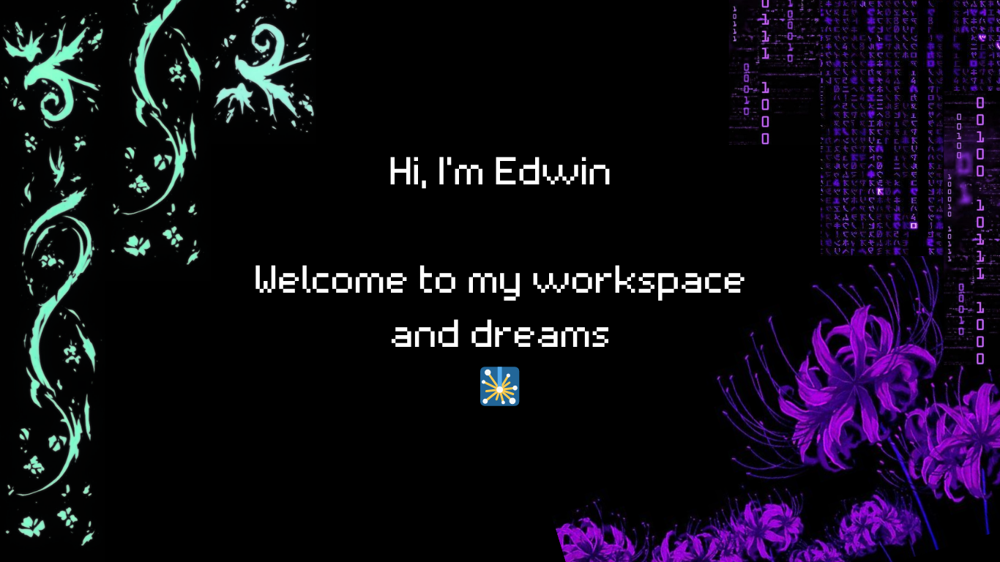

---

## ◾ Acerca de mi

🎓 <strong> - Proximo - Ingeniero en Ciencias de la Computacion. </strong>

🎭  Tengo varias aficiones y hobbies pero puedo encontrar mi lugar en el entorno donde este.

✨ Mi <em>nick</em> suele ser Atlas, pero puedes hablarme como gustes, con confianza 

 ~ *English*

<ul>
  <li>🎓 <strong>Future Computer Science Engineer</strong></li>
  <li>🎭 Versatile interests and adaptable to any environment</li>
  <li>✨ Also known as <strong>Atlas</strong> (nickname) — feel free to use my first name</li>
</ul>

## ◾ Conocimiento

<h2 align="center">⚙️ Tech Stack</h2>

<table>
  <tr>
    <td align="center"><strong style="color:#c084fc;">Languages</strong></td>
    <td align="center">
      
      
      
      
      
    </td>
  </tr>

  <tr>
    <td align="center"><strong style="color:#c084fc;">Frontend</strong></td>
    <td align="center">
      
      
      
    </td>
  </tr>

  <tr>
    <td align="center"><strong style="color:#c084fc;">AI / Data</strong></td>
    <td align="center">
      
      
      
      
      
    </td>
  </tr>

  <tr>
    <td align="center"><strong style="color:#c084fc;">Tools</strong></td>
    <td align="center">
      
      
      
      
      
    </td>
  </tr>

  <tr>
    <td align="center"><strong style="color:#c084fc;">Dev Environments</strong></td>
    <td align="center">
      
      
      
      
    </td>
  </tr>
</table>

<h2 align="center"> GitHub Stats</h2>

  
  

  

